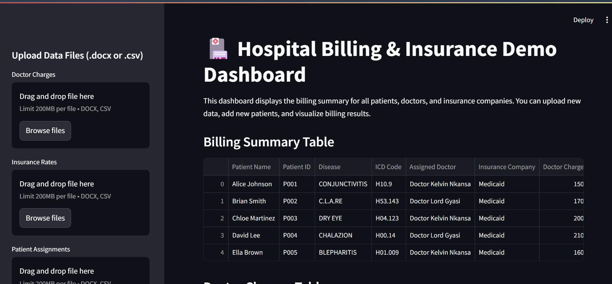
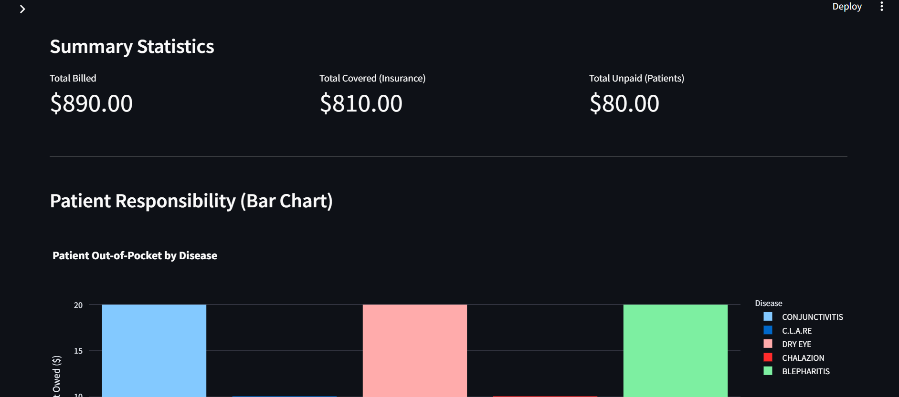
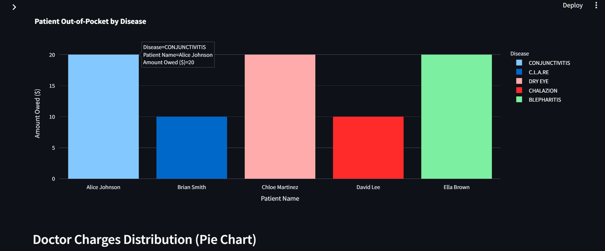

# 🏥 Hospital Insurance Billing System

## Overview

This project is a Python-based application designed by a team of 5 developers to automate billing in hospitals. It takes patient details, services received, and insurance information to calculate the final balance the patient owes after insurance deductions.

The system supports major insurance companies like **Medicaid** and **United Healthcare** and generates a final billing summary that includes a detailed breakdown of services, insurance coverage, and patient responsibilities. The final billing summary is then sent to the customer.

---

## 🚀 Features

- Visualize billing summary for multiple patients, two real doctors (Doctor Kelvin Nkansa and Doctor Lord Gyasi), and multiple insurance companies
- Upload new data files (.docx or .csv) for doctors, insurance, and patients
- Simulate billing for new patients/diseases from the dashboard sidebar
- Download billing summary as CSV
- Interactive charts and statistics
- Accepts patient info and service details (via CPT codes)
- Calculates total billed amount for hospital services
- Determines insurance-covered costs vs. patient responsibility
- Supports multiple insurance companies (Medicaid, UHC, etc.)
- Handles reason codes like `PR1` (Deductible) and `CO45` (Denied)
- Automatically generates a billing summary for the patient
- Option to email billing statements

---

## 📂 Project Structure

```
Insurance_project/
│
├── data/                # All input/output data
│   ├── billing.db       # Main SQLite database (patients, doctors, insurance)
│   ├── diagnosis_codes.xlsx
│   ├── diagnosis_codes.db
│   ├── diagnosistable.pdf
│   ├── uhc_eob_data.csv
│   ├── uhc_eob_data.json
│   ├── Doctor_Charges.docx/csv
│   ├── Medicaid_Insurance_Rates.docx/csv
│   ├── Patient_Disease_Assignments.docx/csv
│   └── ...
│
├── scripts/             # All Python logic
│   ├── dashboard.py         # Streamlit dashboard (main entrypoint)
│   ├── db_models.py         # SQLAlchemy ORM models
│   ├── db_utils.py          # Database utility functions
│   ├── init_sample_data.py  # Script to populate DB with sample doctors & insurance
│   ├── extract_diagnosis_table.py
│   ├── extract_eob_data.py
│   ├── data_loader.py       # Legacy data loading (can be deprecated)
│   └── ...
│
├── assets/              # Dashboard screenshots/images
│   ├── Dashboard.png
│   ├── billing_summary.png
│   ├── download_csv.png
│   └── patient_payment_bar_chart.png
│
├── requirements.txt     # All Python dependencies
├── .gitignore           # Ignore data outputs and temp files
└── README.md            # Project instructions
```

---

## ⚙️ Setup

1. **Clone the repository:**
   ```bash
   git clone https://github.com/Mike-here/Insurance-Claims-Processing
   cd Insurance_project
   ```
2. **Install dependencies:**
   ```bash
   pip install -r requirements.txt
   ```

---

## 🛠️ Usage

### 1. Initialize Database & Sample Data
- Run the following to create the database and populate it with doctors, diseases, and insurance rates:
   ```bash
   python scripts/init_sample_data.py
   ```

### 2. Launch the Dashboard
- Start the Streamlit dashboard:
   ```bash
   streamlit run scripts/dashboard.py
   ```
- Open [http://localhost:8502](http://localhost:8502) in your browser.

### 3. Add/Edit Data
- Use the dashboard UI to add patients, simulate billing, and view summaries.
- All data is now persistent in `data/billing.db` (no more manual CSV editing required).

### 4. (Optional) Extract Diagnosis Codes or EOB Data
- See scripts in `scripts/` for PDF/Excel extraction tools.

1. **Extract Diagnosis Codes:**
   - Place your `diagnosistable.pdf` in `data/`.
   - Run:
     ```bash
     python scripts/extract_diagnosis_table.py
     ```
   - Outputs: `diagnosis_codes.xlsx` and `diagnosis_codes.db` in `data/`.

2. **Extract EOB Data:**
   - Place EOB PDFs (e.g., `uhc eob.pdf`) in `data/`.
   - Run:
     ```bash
     python scripts/extract_eob_data.py
     ```
   - Outputs: `uhc_eob_data.csv` and `uhc_eob_data.json` in `data/`.

3. **Simulate Billing:**
   - Upload new data files (.docx or .csv) for doctors, insurance, and patients in `data/`.
   - Run:
     ```bash
     python scripts/simulate_billing.py
     ```
   - Outputs: Billing summary for new patients/diseases.

---

## 🔄 Workflow Summary

1. Diagnosis codes organized → Search tool (Person 1)
2. EOB PDFs processed → Clean CSV/JSON (Person 2)
3. Payment vs. billed compared → Issues flagged (Person 3)
4. Multi-insurance claims managed → Coordinated results (Person 4)
5. Final insights → Dashboard + Reports (Person 5)

---

## 📦 Requirements
- Python 3.8+
- pdfplumber
- pandas
- openpyxl
- (Optional) pytesseract, Pillow (for scanned PDFs)

---

## 🤝 Contributing
- Scripts go in `scripts/`
- Data files go in `data/` (ignored by Git)
- Update `.gitignore` as needed for new temp/output files

---

## 📝 Notes
- Sensitive or large data files are kept out of version control via `.gitignore`.
- For automated billing emails, see future scripts or modules.
- For dashboard/reporting, see next development steps.

---

## 📧 Contact
For questions or contributions, please contact the project maintainers or open an issue.

---

## 📸 Dashboard Screenshots

### Main Dashboard


### Billing Summary Table


### Patient Responsibility (Bar Chart)


### Download CSV Button


---

## Example Data Format

**Doctor_Charges.csv**
| Disease Name | ICD Code | Doctor A Rate ($) | Doctor B Rate ($) |
|--------------|----------|-------------------|-------------------|
| Diabetes     | E11      | 200               | 220               |

**Medicaid_Insurance_Rates.csv**
| Disease Name | ICD Code | Insurance Company | Insurance Rate ($) |
|--------------|----------|-------------------|--------------------|
| Diabetes     | E11      | Medicaid          | 180                |
| Diabetes     | E11      | United Healthcare | 170                |

**Patient_Disease_Assignments.csv**
| Patient Name | Patient ID | Disease  | ICD Code | Insurance Company |
|--------------|------------|----------|----------|-------------------|
| John Doe     | 001        | Diabetes | E11      | Medicaid          |
| Jane Smith   | 002        | Asthma   | J45      | United Healthcare |
